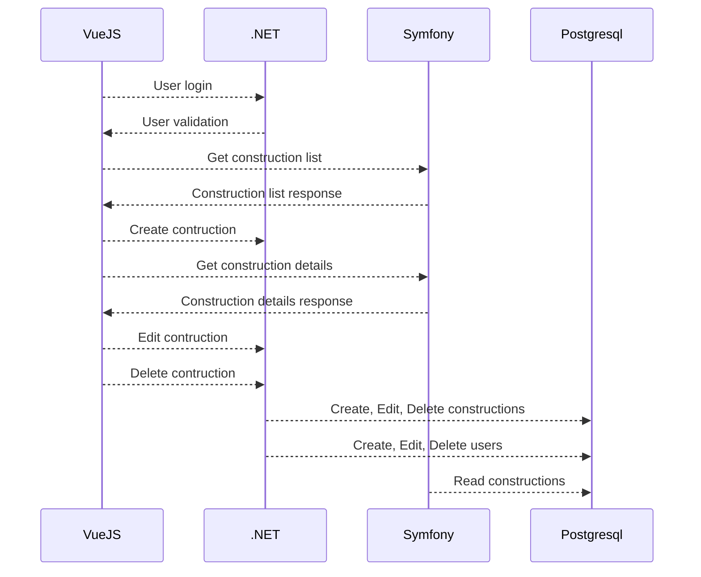

# CPMS - Construction Project Management System
## Development Environment
This application stacks developed using these environment:
1. Docker
```bash 
 Client: Docker Engine - Community
   Version:           27.1.1
   API version:       1.46
   Go version:        go1.21.12
   Git commit:        6312585
   Built:             Tue Jul 23 19:57:01 2024
   OS/Arch:           linux/amd64
   Context:           default

Server: Docker Engine - Community
 Engine:
  Version:          27.1.1
  API version:      1.46 (minimum version 1.24)
  Go version:       go1.21.12
  Git commit:       cc13f95
  Built:            Tue Jul 23 19:57:01 2024
  OS/Arch:          linux/amd64
  Experimental:     false
 containerd:
  Version:          1.7.19
  GitCommit:        2bf793ef6dc9a18e00cb12efb64355c2c9d5eb41
 runc:
  Version:          1.7.19
  GitCommit:        v1.1.13-0-g58aa920
 docker-init:
  Version:          0.19.0
  GitCommit:        de40ad0
   ```
2. Docker compose
    ```bash
     Docker Compose version v2.29.1
     ```
3. Visual Studio Code
    ```bash
    Version: 1.91.1
    Commit: f1e16e1e6214d7c44d078b1f0607b2388f29d729
    Date: 2024-07-09T22:08:12.169Z
    Electron: 29.4.0
    ElectronBuildId: 9728852
    Chromium: 122.0.6261.156
    Node.js: 20.9.0
    V8: 12.2.281.27-electron.0
    OS: Linux x64 6.5.0-44-generic
    ```
4. Running on top of Ubuntu 22.04.4 LTS

Feel free to try and use different versions of the environment, but I can't guarantee the compatibility.

## Setup Environment
1. Clone this repository 
    ```bash 
     user@laptop:~$ git clone https://github.com/h4n0l1/construction
     ```
2. Go to repository folder and copy `.env.example` to `.env` make changes to `.env` 
    ```bash
    user@laptop:~$ cd construction
    user@laptop:~/construction$  cp .env.example .env
    user@laptop:~/construction$  vi .env
    user@laptop:~/construction$  cat .env
    #VueJS App
    NODE_ENV=development
    VITE_APP_BASE_URL_DOTNET=http://example-url1
    VITE_APP_BASE_URL_SYMFONY=http://example-url2
    
    #.NET App
    ALLOWED_HOST1=http://host1
    ALLOWED_HOST2=http://host2
    ConnectionStrings__DefaultConnection="Host=db;Database=cpms_db;Username=cpms_dbu;Password=ThisIsAlsoSecret" 
    #For ConnectionStrings should be match with config in #DB, 
    #Host value will use service name in docker-compose.yml, which is 'db'
    
    #DB
    PGADMIN_DEFAULT_EMAIL=user@mail.com
    PGADMIN_DEFAULT_PASSWORD=SuperSecret
    POSTGRES_PASSWORD=ThisIsAlsoSecret
    POSTGRES_USER=cpms_db
    POSTGRES_DB=cpms_dbu
    ```
3. Also make changes for `.env` file in `symfony-api` folder
   ```bash
   user@laptop:~/construction$ cd symfony-api
   user@laptop:~/construction/symfony-api$ cp .env.example .env
   user@laptop:~/construction/symfony-api$ cp .env.test.example .env.test 
   ```
4. There are 2 options to run the apps with docker compose, you can use `watch` option:
   ```bash
   user@laptop:~/construction/symfony-api$ cd ..
   user@laptop:~/construction$ docker compose watch
   .......some building process output ....
   => => exporting layers            0.0s
   => => writing image sha256:746ed  0.0s
   => => naming to docker.io/library/construction-csharpapp  0.1s
   => [csharpapp] resolving provenance for metadata file     0.0s
   [+] Running 7/7
   ✔ Network construction_default        Created   0.6s 
   ✔ Volume "construction_pgdata"        Created   0.1s 
   ✔ Container construction-pgadmin-1    Started   5.7s 
   ✔ Container construction-db-1         Started   5.9s 
   ✔ Container construction-vue-app-1    Started   5.6s 
   ✔ Container construction-php-1        Started   6.3s 
   ✔ Container construction-csharpapp-1  Started   6.1s 
   Watch enabled
   ```
   With this option, every time changes are made inside folder `dotnet-api` or `vuejs-app`, it will trigger `rebuild` process. Please check `docker-compose.yml` file for more details.
5. Or just simply use `docker compose up -d`, then the `watch` feature will not be triggered

## Post Environment Setup
Before the application can be used, we need to prepare the tables
1. Open `pgadmin` app from the browser, go to `http://localhost:2000/`. Please refer to PgAdmin [documentation](https://www.pgadmin.org/docs/pgadmin4/development/getting_started.html) for more details on creating connection.
2. Execute all queries from `prepare.sql`.
3. Now, each of these application can be accessed through:
	* VueJS App at `http://localhost:8082`
	* Symfony App at `http://localhost:8081/api/docs` for the API documentation
	* .NET App at `http://localhost:8080
4. To create user for VueJS app, make the request using curl or `Postman`:
    ```bash
    curl -X POST "http://localhost:8080/api/users" -H "Content-type: application/json" --data '{"password": "123456", "email": "me@mail.com"}'
    ```
## Request Diagrams

This is a specific scenario, how the `VueJS` app make request to both `.NET` app and `Symfony` app in these stacks. 

## Notes
1. Unit test currently only working for `.NET` app and `Symfony API`, and it's only an example on how the unit test should work. Feel free to add more test case and submit PRs.
   For `.NET` unit test executed during docker image build, check `Dockerfile` inside `dotnet-api` folder, look for this line:
    ```bash
    RUN  dotnet  test
    ```
    If this part need to be skipped, comment the line with `#`.
    For `Symfony`, before executing `php bin/phpunit` make sure the `APP_ENV` set to `test`.
2. Unit test and used of environment variables currently still not working for `VueJS App`, feel free to create PR if you know how those things should work. I will really appreciate it!
3. By the time this readme file submitted, I was working on this development for not more than 4 days, there still a lot off part of these app should be improved. Feel free to create PR if you find something need to be improved.

